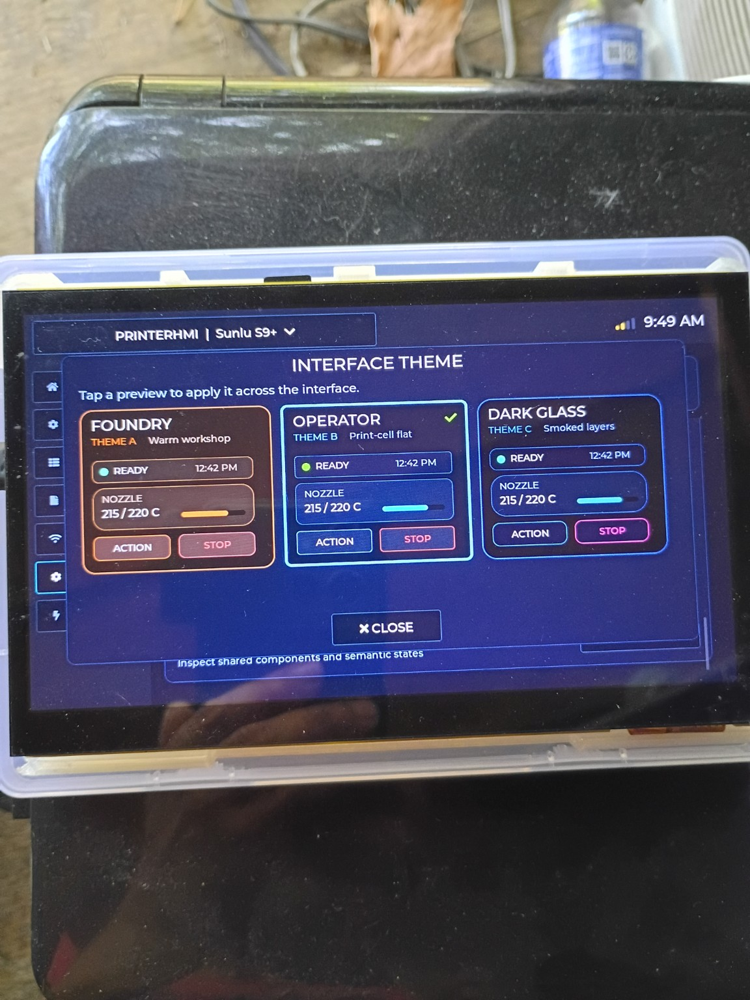
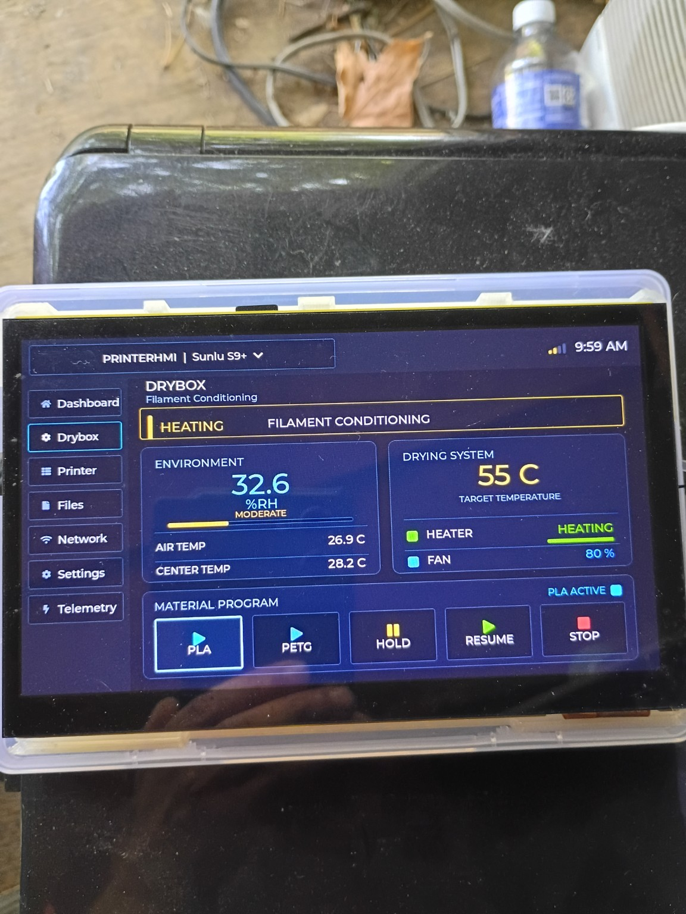
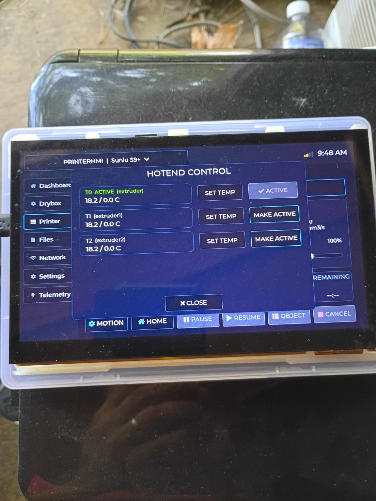
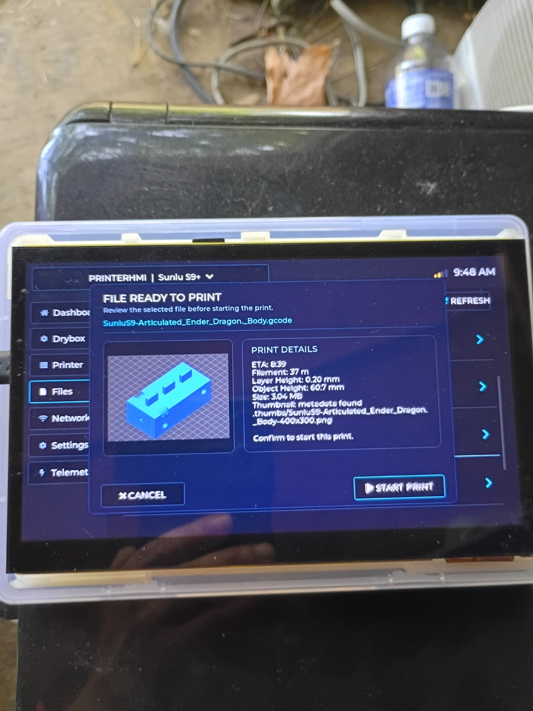
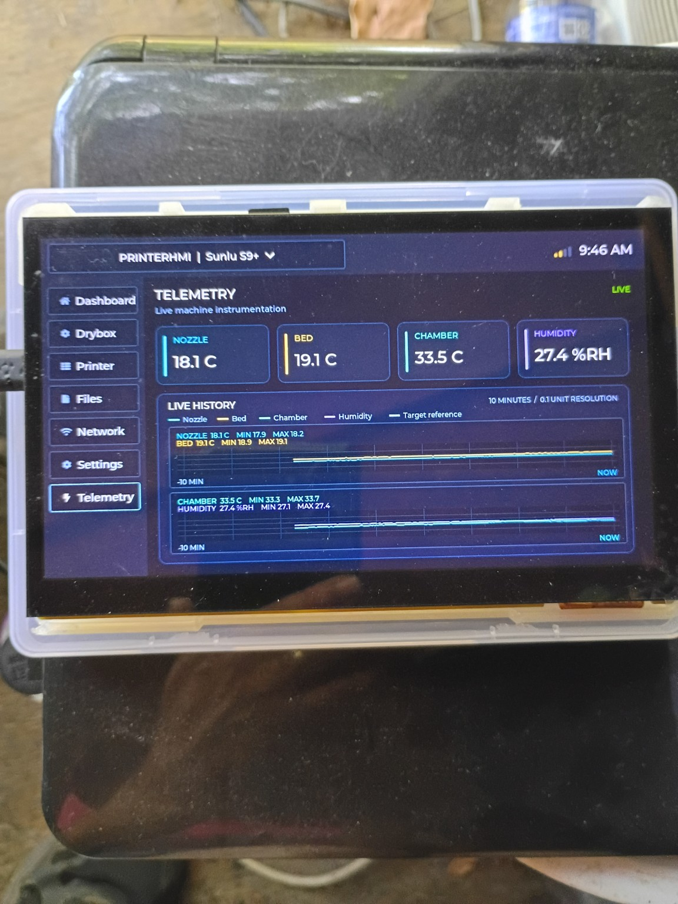
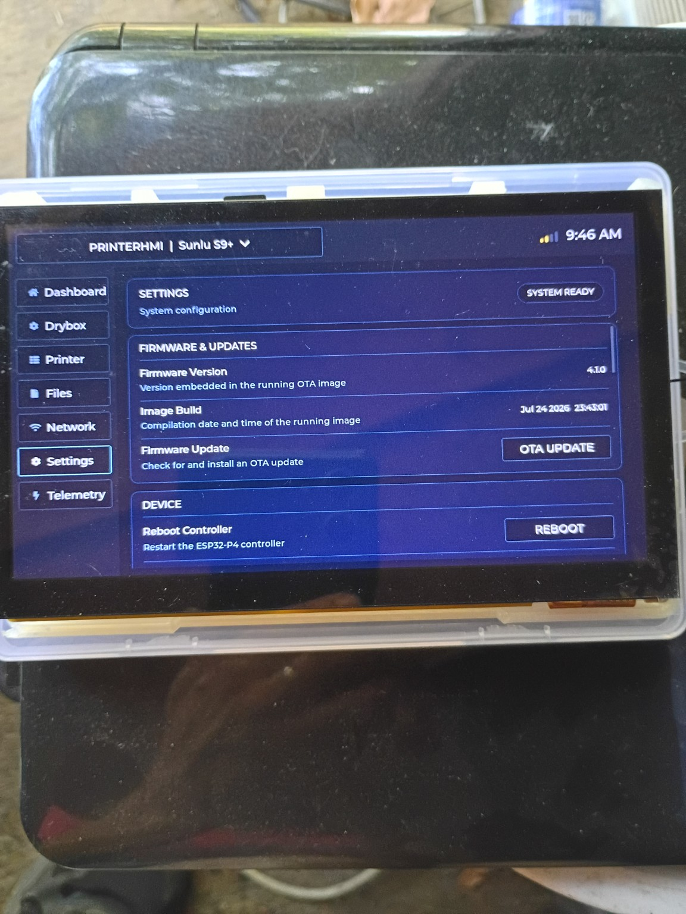
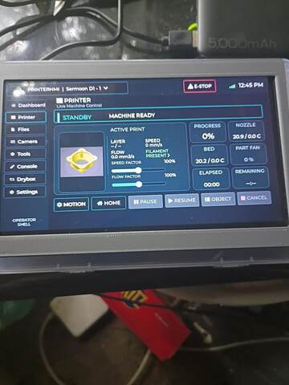
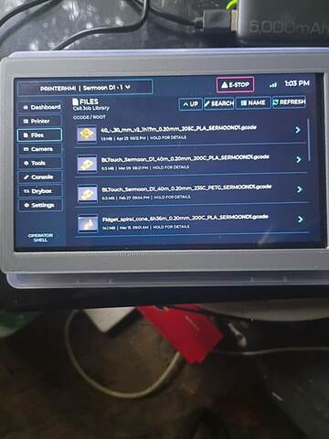
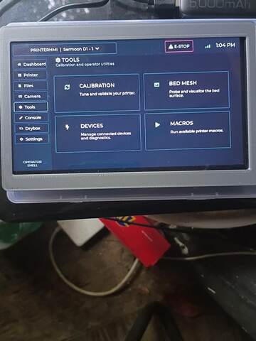
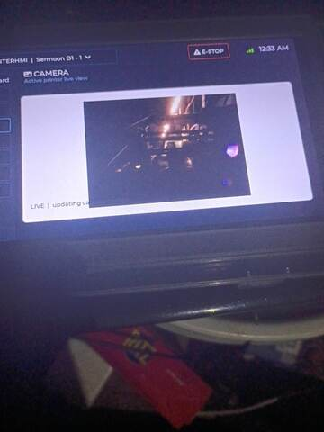

# PrinterHMI

PrinterHMI is a dedicated 1024 x 600 touchscreen operator interface for a
Klipper/Moonraker print cell. The v6.4.0 firmware targets the ESP32-P4 based
JC1060P470C-I/W panel and communicates with its ESP32-C6 networking
coprocessor through Espressif's hosted Wi-Fi stack.

The current release supports up to four Moonraker printer profiles, live
printer and drybox status, file browsing with thumbnails and metadata,
telemetry, print controls, exclude-object control, a dedicated 3D Bed Mesh
workspace, detected Klipper macros, a live console, persistent display and
timezone settings, runtime themes, and OTA firmware updates.

## Status

- Firmware version: `6.4.0`
- Target: `esp32p4`
- Known-good ESP-IDF: `6.0.2`
- LVGL: `9.5.0` as locked by `dependencies.lock`
- Display: JD9165, 1024 x 600, MIPI-DSI
- Touch: GT911 over I2C
- Network: ESP32-C6 through `esp_wifi_remote`/`esp_hosted`
- Release state: stable

See [Known Issues](docs/KNOWN_ISSUES.md) before distributing firmware or
publishing repository history.

## Operator features

- Dashboard with active-printer identity, print status and cached preview
- Capability-aware printer controls for motion, independently controlled hotends, active-tool selection, bed, fan, speed, flow and print state
- Live switch and motion filament-sensor status with multi-sensor detail
- Moonraker exclude-object selection and confirmation
- Files page with search, row thumbnails, long-press preview and metadata
- Dedicated Bed Mesh page with color height surface, rear reference planes,
  origin markers, statistics, calibration, profile management and multitouch
- Capability-aware guided Calibration workflows with safe persistence
  confirmations
- Capability-aware Devices catalog with filtering, pagination and live values
- Detected public Klipper macros with confirmation before execution
- Live command console with bounded history and response severity colors
- Multi-printer profile selection for as many as four Moonraker instances
- Drybox status and PLA/PETG/hold program controls
- Auto-scaling combined temperature and humidity telemetry
- Operator event history and configuration backup/restore
- Network configuration with Moonraker discovery inside printer profile Add/Edit
- Optional per-profile verified HTTPS/WSS Moonraker transport with local CA selection
- Classic, Operator and Dark Glass runtime themes plus validated SD-card
  custom themes authored externally and applied from the SD card
- Accent, density, high-contrast, large-text, reduced-transparency and
  reduced-motion appearance settings
- Persistent brightness, display sleep and timezone configuration
- OTA download with cancellable progress, dual-slot boot and rollback cancellation

## Interface on Hardware

PrinterHMI v6.4.0 running on the JC1060P470C-I/W ESP32-P4 panel.
These photographs show the interface operating on the target hardware.

<!-- PRINTERHMI_HARDWARE_GALLERY_V1 -->

| Runtime theme selection | Active filament conditioning |
| :---: | :---: |
|  |  |
| Multi-hotend discovery and control | File thumbnail and print metadata |
|  |  |
| Auto-scaling live telemetry | Firmware and device settings |
|  |  |

## Camera v2 and Operator Shell on Hardware

These v6.3.0 photos show the Operator Shell on its target ESP32-P4 hardware,
including printer controls, the file library, operator utilities and live camera.

| Printer control | Files library |
| :---: | :---: |
|  |  |
| Tools workspace | Live camera view |
|  |  |

## Repository map

| Path | Purpose |
| --- | --- |
| `main/` | Application, UI, controllers, Moonraker transport and assets |
| `components/` | Board support component used by this hardware |
| `common_components/` | Project-local BSP extensions |
| `partitions.csv` | Dual-OTA flash layout |
| `sdkconfig.defaults` | Reproducible project configuration defaults |
| `sdkconfig` | Known-good resolved ESP-IDF configuration |
| `dependencies.lock` | Resolved component versions |
| `docs/` | Current authoritative documentation |
| `docs/history/` | Historical v3.x plans, reviews and refactor records |

## Quick start

Install ESP-IDF 6.0.2, then:

```bash
git clone https://github.com/khelix1/PrinterHMI.git PrinterHMI
cd PrinterHMI
./tools/build_idf6_hosted3.sh

# Or build and package both the P4 and C6 firmware stack:
./tools/build_v6_stack.sh

source "$HOME/esp/esp-idf-v6.0.2/export.sh"
idf.py -B build-idf6-hosted3 \
    -D SDKCONFIG="$PWD/sdkconfig.idf6" \
    -p /dev/ttyUSB0 flash monitor
```

Use the serial device appropriate for the workstation. Do not commit local
network credentials or API keys.

## Documentation

- [Documentation index](docs/README.md)
- [Architecture](docs/ARCHITECTURE.md)
- [Build instructions](docs/BUILDING.md)
- [Hardware](docs/HARDWARE.md)
- [Configuration and persistence](docs/CONFIGURATION.md)
- [Custom themes](docs/CUSTOM_THEMES.md)
- [Flashing and OTA](docs/FLASHING_AND_OTA.md)
- [Testing](docs/TESTING.md)
- [Troubleshooting](docs/TROUBLESHOOTING.md)
- [Release checklist](docs/RELEASE_CHECKLIST.md)
- [Secure Moonraker setup](docs/SECURE_MOONRAKER_SETUP.md)
- [Git workflow](docs/GIT_WORKFLOW.md)
- [Security policy](SECURITY.md)
- [Changelog](CHANGELOG.md)

## Development policy

Keep `main.c` as the application coordinator. Page modules own page layout and
page-local interaction; service modules own transport, persistence, parsing
and background work. Every functional change should be built, installed on the
target, exercised, and committed only after the device test passes.

See [CONTRIBUTING.md](CONTRIBUTING.md) for the branch and review workflow.

## License

PrinterHMI's original source code and documentation are licensed under the
[Apache License 2.0](LICENSE).

Vendored and third-party components retain the licenses and copyright notices
found in their respective directories. The PrinterHMI name and logo are not
granted as trademarks by the Apache License.

See [CONTRIBUTING.md](CONTRIBUTING.md), [CODE_OF_CONDUCT.md](CODE_OF_CONDUCT.md)
and [SECURITY.md](SECURITY.md) before participating.

## Encrypted configuration backups

Configuration Backup supports a plain, API-key-free SD export and an optional
passphrase-encrypted export that includes Moonraker API keys. See
[`docs/ENCRYPTED_CONFIGURATION_BACKUPS.md`](docs/ENCRYPTED_CONFIGURATION_BACKUPS.md)
for operation, recovery, and security details.
