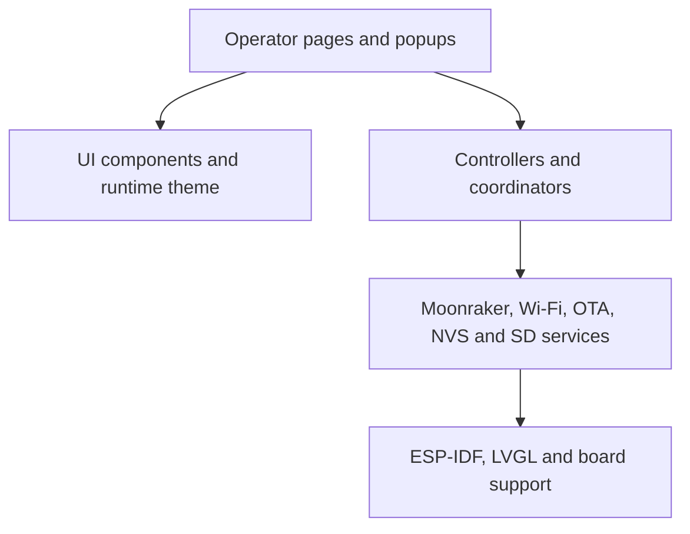

# PrinterHMI architecture

## Scope

PrinterHMI v4.2.0 is an ESP-IDF application for an ESP32-P4 operator panel.
It presents an LVGL interface and connects through an ESP32-C6 hosted network
coprocessor to as many as four Klipper/Moonraker printers.

## Architectural rule

`main.c` is the application coordinator. It owns startup order, shared runtime
state and bridges between independently owned modules. It must not become the
default owner for page layout, network transport, persistence or parsing.

Page modules own page lifetime and page-local widgets. Controllers own policy
and state translation. Service modules own transport, storage, parsing and
background work. Shared UI modules own visual contracts.

## Runtime layers

### Application coordination

- `main.c` initializes NVS, themes, timezone, Moonraker state, display, SD,
  Wi-Fi and the UI shell.
- It routes shell navigation, cross-page live data and compatibility bridges.
- It allocates the Moonraker HTTP capture buffer in PSRAM with an internal-RAM
  fallback.

### Shell and pages

`ui_shell` owns the persistent top status bar, navigation rail, clock and active
printer identity. It routes seven pages: Dashboard, Drybox, Printer, Files,
Network, Settings and Telemetry.

Each page has a top-level UI owner. Larger pages delegate to components such as
status banners, cards, previews, charts, action panels and popup controllers.

### Shared UI system

- `ui_theme` is the runtime style contract.
- `ui_theme_a`, `ui_theme_b` and `ui_theme_c` implement Classic, Operator and
  Dark Glass visual policies.
- `theme_manager` loads and saves the selected theme, accent, density and
  accessibility settings.
- `ui_button`, `ui_cards`, `ui_popup`, `ui_page_title` and `ui_widgets` provide
  shared primitives.
- Existing screens are rebuilt after appearance changes so existing LVGL
  objects receive the newly selected theme.
- `ui_popup` owns modal behavior; an open popup blocks interaction with the
  interface beneath it.

### Moonraker integration

- `moonraker_config_controller` owns up to four persistent printer profiles and
  a generation counter used to reject stale work.
- `moonraker_live_websocket` subscribes to live Klipper objects and merges
  status updates into synchronized Moonraker state.
- `moonraker_poll` and `moonraker_live_transport` provide scheduled HTTP state
  refresh and fallback behavior.
- `moonraker_probe` and `moonraker_discovery` test and discover endpoints;
  discovery is presented inside printer profile Add/Edit.
- File, metadata, thumbnail, G-code and print-start requests are implemented by
  `moonraker` and consumed through controllers.

### Printer and files

- Printer UI policy is split between `printer_controller`,
  `printer_ui_controller` and focused `ui_printer_*` modules.
- File listing and selection are coordinated by `files_page_controller` and
  `printer_file_controller`.
- Thumbnail sessions, download, decode, RGB565 rendering and preview caching
  are separate modules.
- Large image/message buffers prefer PSRAM. Rendered profile previews can be
  persisted on SD storage.

### Settings and persistence

NVS stores network configuration, printer profiles, theme selection,
accessibility settings, brightness, display sleep, timezone, OTA URL and the
last selected file. Factory reset erases NVS and reboots; it does not erase SD
card content.

### OTA lifecycle

The OTA manager downloads to the inactive application slot. The progress
popup can request cancellation; the worker aborts the OTA handle and returns
without rebooting or selecting the incomplete image. On successful installation
the device reboots. When rollback marks the new image as pending verification,
startup marks the running image valid and cancels rollback.

## Startup sequence

1. Initialize NVS, recovering from incompatible or exhausted storage.
2. Load theme and timezone state.
3. Initialize synchronized Moonraker state.
4. Hold the backlight off and initialize the ESP-Hosted/C6 transport.
5. Allocate PSRAM-backed capture storage.
6. Start the BSP display/touch path with the LVGL task on CPU 1.
7. Build the dashboard, printer chooser and splash with the backlight off.
8. Restore brightness and start Wi-Fi association.
9. Start SNTP, delayed SD mounting and Moonraker runtime services.
10. Mark a pending OTA image valid when rollback is enabled.

## Concurrency rules

- LVGL objects may be accessed only from LVGL callbacks or while holding the
  BSP display lock.
- Background HTTP, WebSocket, discovery, preview and OTA work must publish
  results without directly mutating LVGL objects.
- Active-printer configuration changes increment a generation. Results from a
  retired generation must be discarded.
- DMA buffers must use DMA-capable memory; general large buffers should prefer
  PSRAM when latency permits.

## Source of truth

- Build membership: `main/CMakeLists.txt`
- Dependency versions: `dependencies.lock`
- Flash layout: `partitions.csv`
- Resolved configuration: `sdkconfig`
- Reproducible defaults: `sdkconfig.defaults`
- Current module ownership: `docs/PROJECT_FILE_CATALOG.md`

The v3.x architecture documents are historical and live under
`docs/history/architecture/`.
