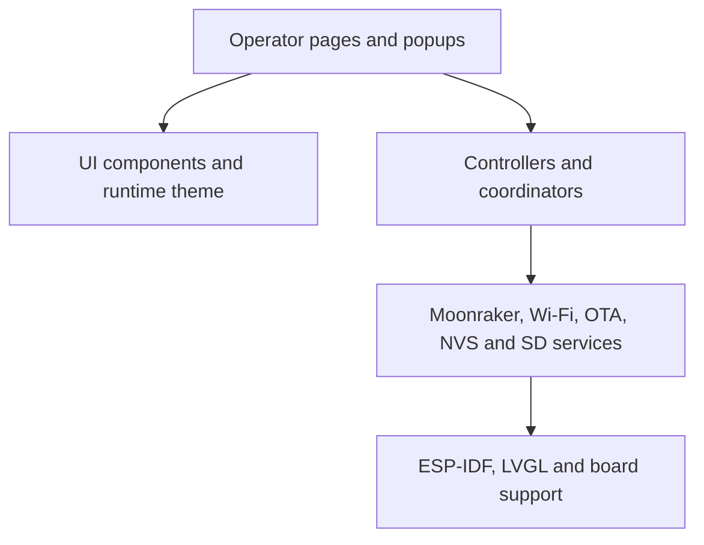

# PrinterHMI architecture

## Scope

PrinterHMI v6.5.6 is an ESP-IDF application for an ESP32-P4 operator panel.
It presents an LVGL interface and connects through an ESP32-C6 hosted network
coprocessor to as many as four Klipper/Moonraker printers.

## Architectural rule

`main.c` is the application coordinator. It owns startup order, shared runtime
state and bridges between independently owned modules. It must not become the
default owner for page layout, network transport, persistence or parsing.

Page modules own page lifetime and page-local widgets. Controllers own policy
and state translation. Service modules own transport, storage, parsing and
background work. Shared UI modules own visual contracts.

## Runtime layers

```mermaid
flowchart TD
    A[Operator pages and popups] --> B[UI components and runtime theme]
    A --> C[Controllers and coordinators]
    C --> D[Moonraker, Wi-Fi, OTA, NVS and SD services]
    D --> E[ESP-IDF, LVGL and board support]
```

### Application coordination

- `main.c` initializes NVS, themes, timezone, Moonraker state, display, SD,
  Wi-Fi and the UI shell.
- It routes shell navigation, cross-page live data and compatibility bridges.
- It allocates the Moonraker HTTP capture buffer in PSRAM with an internal-RAM
  fallback.

### Shell and pages

`ui_shell` owns the persistent top status bar, navigation rail, clock and active
printer identity. It routes ten pages in operator workflow order:
Dashboard, Printer, Files, Bed Mesh, Macros, Console, Telemetry, Drybox,
Network and Settings. Its persistent runtime pointer tables are allocated once
in PSRAM after scheduler startup.

Each page has a top-level UI owner. Larger pages delegate to components such as
status banners, cards, previews, charts, action panels and popup controllers.

### Shared UI system

- `ui_theme` is the runtime style contract.
- `ui_theme_a`, `ui_theme_b` and `ui_theme_c` implement Classic, Operator and
  Dark Glass visual policies.
- `theme_manager` loads and saves the selected theme, accent, density and
  accessibility settings.
- `ui_button`, `ui_cards`, `ui_popup`, `ui_page_title` and `ui_widgets` provide
  shared primitives.
- Existing screens are rebuilt after appearance changes so existing LVGL
  objects receive the newly selected theme.
- `ui_popup` owns modal behavior; an open popup blocks interaction with the
  interface beneath it. `ui_about_popup` is a focused Settings-owned
  consumer of those shared popup primitives.

### LVGL page refresh and layout

Console retains up to 64 labels, Macros up to 64 buttons, and Devices up to
12 cards while each page is open. Refreshes rebind and hide slots rather than
cleaning and rebuilding the list. The pointer tables use permanent PSRAM-first
contexts; page teardown clears references before a later reopen.

Macro callbacks read the current catalog index from object user data and reject
stale discovery generations. Device live-value bindings are cleared and registered
against the current catalog after each page or filter change.

Shared modal footer actions use Grid tracks; macro parameter fields use a
scrolling two-column Grid with Flex cells. Callbacks can use
`ui_popup_find_owner()` to resolve the modal through nested layout containers.
Preview wells use native image `COVER`; fitted images and fullscreen previews
use `CONTAIN`. See [the modernization scope](LVGL_MODERNIZATION.md).

### Live value updates

`ui_value_update.h` provides display-lock-only comparisons against live widget
text/local colors and deferred shift-mode chart appends using LVGL public APIs.
Dashboard, Printer and Telemetry keep their existing formatting and cadence.
Chart owners refresh shared plots after batches; time history continues recording
flat values. These helpers do not own timers, transport or detached value caches.

### Ownership boundaries and next seams

- `main.c` coordinates startup, lifecycle transitions and narrow adapters only. New
  page layout, parsing, persistent storage and transport policy belong to focused
  owners rather than being added there.
- Page owners may compose widgets and route operator intent. They do not perform
  blocking HTTP, SD or OTA work.
- Controllers translate state and enforce policy; services own I/O, background
  work, persistence and parsing. Background work publishes data, never LVGL
  mutations.
- The next maintenance extractions, when behavior requires change, are focused
  slices from `main.c`, `ui_calibration` and `ui_printer_popups`. They are not
  prerequisite refactors for ordinary feature work.

### Moonraker integration

- `moonraker_config_controller` owns up to four persistent printer profiles and
  a generation counter used to reject stale work.
- `moonraker_live_websocket` subscribes to live Klipper objects, including
  authoritative `virtual_sdcard` print progress, and merges updates into
  synchronized Moonraker state. It owns non-blocking recovery while a
  WebSocket is reconnecting.
- `moonraker_poll` and `moonraker_live_transport` provide scheduled HTTP state
  refresh and fallback behavior without competing with reconnect ownership.
- `moonraker_probe` and `moonraker_discovery` test and discover endpoints on
  ports 7125 through 7128; discovery is presented inside printer profile
  Add/Edit.
- Released secure transport keeps per-profile persistence in
  `moonraker_config_controller`, TLS policy and no-downgrade resolution in
  `moonraker_transport_security_controller`, and per-profile PSRAM-first CA
  trust material in `moonraker_tls_trust_store`; endpoint consumers share that
  policy.
- File, metadata, thumbnail, G-code and print-start requests are implemented by
  `moonraker` and consumed through controllers.
- `macro_controller` derives a bounded, alphabetized public-macro catalog from
  Moonraker object discovery while excluding underscore-prefixed helpers.
  Configuration queries supply macro parameter hints; `macro_parameter_utils`
  validates names/values and constructs a bounded command for review.
- `console_controller` retains bounded command and response history and
  receives live `notify_gcode_response` WebSocket messages.

### Camera

- `ui_camera` owns live-view presentation, fullscreen geometry and camera-page controls.
- `camera_stream_controller` owns the bounded continuous MJPEG connection and
  PSRAM-first frame handoff; `camera_jpeg_decoder` owns ESP32-P4 JPEG decode.
- `camera_discovery_controller` performs Moonraker webcam discovery without
  LVGL access; `camera_catalog_controller` owns the persistent per-profile
  catalog and preserves the legacy first configured stream.
- Camera discovery follows the active profile's transport-security policy and
  uses a PSRAM-first TLS-capable worker stack.

### Printer and files

- Printer UI policy is split between `printer_controller`,
  `printer_ui_controller` and focused `ui_printer_*` modules.
- File listing and selection are coordinated by `files_page_controller` and
  `printer_file_controller`.
- Thumbnail sessions, download, decode, RGB565 rendering and preview caching
  are separate modules.
- Profile and Files rendered-pixel pools use PSRAM only, with four and 24
  shared-size slots respectively. Files publication uses display-lock-then-slot-
  mutex ordering and transfers the completed worker buffer into its slot.
  Fullscreen owns its fallback snapshot and releases it after installing hires.
- Other large image/message buffers prefer PSRAM. Rendered profile previews can be
  persisted on SD storage.

### Calibration, Bed Mesh, Devices, Macros and Console

- `ui_calibration` composes calibration workflows; `ui_calibration_layout` owns its reusable cards, labels and capability summaries.
  `ui_calibration_geometry`, `ui_calibration_motion`, `ui_calibration_pressure_advance` and
  `ui_calibration_manual_probe`, `ui_calibration_custom`, `ui_calibration_pid` and `ui_calibration_results` own their focused workflows. The shared
  manual-probe surface provides coarse and 0.005 mm fine TESTZ steps for
  both Probe/Z and Axis Twist, while `calibration_capability_controller`
  and `calibration_session_controller`
  retain capability and session policy.
- `ui_probe_accuracy` runs 5/10/20-sample checks through the shared session
  owner and shows final statistics without SAVE_CONFIG. Dispatch rechecks the
  active printer, readiness and idle/homed requirements.
- `motion_diagnostics_controller` merges partial toolhead/TMC status updates
  and configuration reference values into a bounded, profile-fenced snapshot.
  `ui_motion_diagnostics` owns read-only limits/driver views and the local
  hardware-geometry calculator, including popup and timer teardown.
- `endstop_status_controller` matches request IDs to the active profile,
  handles timeouts and rejects stale responses. `ui_endstop_status` requests
  structured WebSocket readings every two seconds while the printer is idle;
  printing/paused states suspend queries.
- `ui_bed_mesh` composes the 3D mesh page. Gesture recognition, rendering
  and profile dialogs belong to `ui_bed_mesh_gestures`,
  `ui_bed_mesh_renderer` and `ui_bed_mesh_profiles`; `bed_mesh_controller`
  remains the snapshot source.
- `ui_devices` composes the Devices page and Telemetry bridge.
  `ui_devices_catalog_view` owns filters, cards, pagination and refresh timing;
  `ui_devices_live_values` translates synchronized Moonraker state for visible
  labels; `device_catalog_controller` owns discovery and classification.
- `ui_macros` and `macro_controller` own public-macro presentation and
  policy, search, detected parameter entry and final command confirmation.
  `ui_console` and `console_controller` own command entry and bounded response history.
  `console_filter` applies presentation-only type/text filters and recognizes complete
  numeric temperature reports; it does not remove entries or change calibration ingestion.
  Console filter preferences survive page navigation for the current HMI session.
- Long-lived feature contexts and bounded catalogs prefer PSRAM with an
  internal-RAM fallback.

### Settings and persistence

`wifi_credentials_store` owns the NVS read/write boundary for Wi-Fi credentials.

NVS stores network configuration, printer profiles, theme selection,
accessibility settings, brightness, display sleep, timezone, OTA URL and the
last selected file. Factory reset erases NVS and reboots; it does not erase SD
card content.

### OTA lifecycle

`ota_ui_controller` owns release-catalog, custom-URL and popup dispatch; `ota_manager` owns the update transaction.

The OTA manager downloads to the inactive application slot. The progress
popup can request cancellation; the worker aborts the OTA handle and returns
without rebooting or selecting the incomplete image. On successful installation
the device reboots. When rollback marks the new image as pending verification,
`ota_boot_validation` marks the running image valid and cancels rollback after the splash lifecycle completes.

## Startup sequence

1. Initialize NVS, recovering from incompatible or exhausted storage.
2. Load theme and timezone state.
3. Initialize synchronized Moonraker state.
4. Hold the backlight off and initialize the ESP-Hosted/C6 transport.
5. Allocate PSRAM-backed capture storage.
6. Start the BSP display/touch path with the LVGL task on CPU 1.
7. Build the dashboard, printer chooser and splash with the backlight off.
8. Restore brightness and start Wi-Fi association.
9. Start SNTP, delayed SD mounting and Moonraker runtime services.
10. Mark a pending OTA image valid when rollback is enabled.

## Concurrency rules

- LVGL objects may be accessed only from LVGL callbacks or while holding the
  BSP display lock.
- Background HTTP, WebSocket, discovery, preview and OTA work must publish
  results without directly mutating LVGL objects. Inactive-profile preview
  and health HTTP work belongs to its low-priority worker, never the shell
  runtime task.
- Active-printer configuration changes increment a generation. Results from a
  retired generation must be discarded.
- DMA buffers must use DMA-capable memory; general large buffers should prefer
  PSRAM when latency permits.
- Avoid adding sizeable static internal-RAM state. FreeRTOS creates its
  statically configured timer task before `app_main()`, so long-lived UI and
  controller contexts should be allocated permanently from PSRAM after the
  scheduler starts.

## Source of truth

- Build membership: `main/CMakeLists.txt`
- Dependency versions: `dependencies.lock`
- Flash layout: `partitions.csv`
- Resolved configuration: `sdkconfig`
- Reproducible defaults: `sdkconfig.defaults`
- Current module ownership: `docs/PROJECT_FILE_CATALOG.md`

The v3.x architecture documents are historical and live under
`docs/history/architecture/`.

## Banner status subjects

`ui_status_banner` owns two per-instance string subjects for its state and
operator message/active filename. The public banner setter publishes to these
subjects under existing UI/display-lock ownership; native object observers
update labels. Previous-value storage suppresses unchanged notifications, while
long values and unavailable bindings preserve direct-update behavior. Subject
cleanup precedes backing-storage release in the parent's DELETE callback. There
is no background-task subject access or new transport/model ownership.

Chooser cards each own a status string subject, current/previous storage and an
object-bound label observer. Refresh retains existing health-state selection and
local color comparisons; the subject handles text changes. The card DELETE
callback deinitializes its subject before child destruction and card-slot reuse.
No network task publishes to subjects, and no additional timers are introduced.

Chooser name and endpoint labels now also use card-owned string subjects. The
existing refresh path publishes current configuration text, and click routing
continues resolving the card's profile index. All three card subjects are
deinitialized on card deletion before static storage is cleared or reused.

Camera frame retirement: `ui_camera` detaches the image descriptor and drops its
LVGL cache before freeing owned RGB565 pixels. A published frame must have enough
bytes for its packed dimensions before mirror/transform work. Page hide stops the
worker and retires the frame; view changes update the current viewport transform
immediately. The continuous MJPEG worker and JPEG decoder retain ownership of
network acquisition and decode respectively.

Offline navigation retires camera consumers and fences the old Moonraker
WebSocket generation on the LVGL owner without waiting for transport shutdown.
Camera workers retain transport ownership until their own cleanup completes;
OTA/setup may still explicitly wait. The runtime task owns WebSocket teardown
and rebind. Files list HTTP/retries run in a worker with copied endpoint data;
one current job and one coalesced pending job bound ownership. Only the LVGL
result timer may parse/render for the current profile/request/page, and it holds
a queued result while a file confirmation is open. Stale results are freed.

Responsive page layout helpers in `main/ui_responsive_layout.h` use native flex
wrapping with equal card widths resolved only on size changes. Tools and Macros
own their wrapping tile/button containers; macro rows retain stable objects and
command/generation ownership. Files owns a column of header, toolbar, breadcrumb
and a growing viewport; its rows resolve label width from the current row size.
Shared page-state overlays center content with a native column. These changes
consume the existing runtime fonts/metrics/palettes and preserve preview and
transport ownership.
